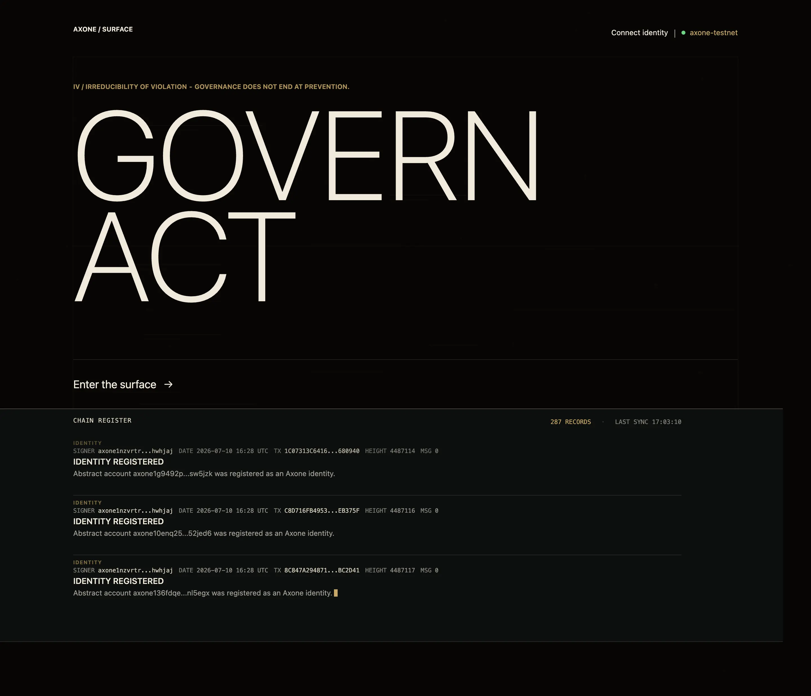

# Axone Surface

> ◌ governed situations - made readable

[](https://github.com/axone-protocol/surface/actions/workflows/lint-commits.yml)
[](https://github.com/axone-protocol/surface/actions/workflows/build.yml)

[](https://nixos.org/)
[](https://vuejs.org/)

[](https://conventionalcommits.org)
[](https://github.com/axone-protocol/.github/blob/main/CODE_OF_CONDUCT.md)
[](https://opensource.org/licenses/BSD-3-Clause)

_Axone Surface_ is the public interface to the [Axone protocol](https://axone.xyz).

It makes the protocol's laws, identities, capabilities, and on-chain acts
readable through an experiential web interface.

Surface presents Axone as a living system, connecting its doctrine with the
activity attested by the chain.



## Development

### Local setup

Enter the development environment, install the dependencies, and start the development server.

```bash
nix develop
pnpm install
pnpm dev
```

### Validation

Run the project checks before submitting changes.

```bash
pnpm run check
pnpm run lint
pnpm run format:check
pnpm run test:unit
pnpm run test:e2e
pnpm run build
```

### Environment

The repository provides a [Nix](https://nixos.org/) development shell with the required tooling.

If you use direnv, run direnv allow once from the repository root.
